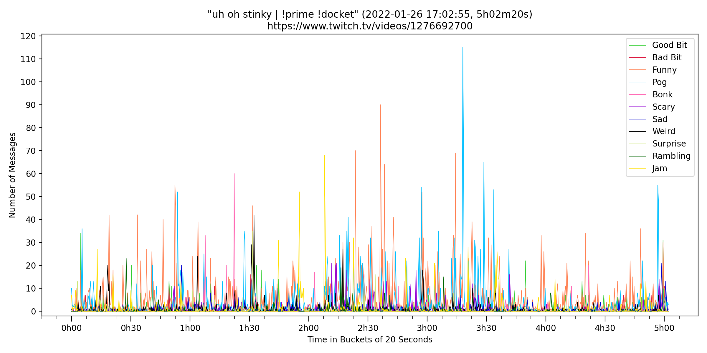

# Twitch Chat Highlights

A collection of Python scripts used to find highlights in Twitch streams according to specific words and emotes posted in chat. For example, finding the top 10 funniest moments by counting the occurrence of the LUL emote in a 20-second window.



## Dependencies

Before running the scripts, the following packages must be installed: [Twitch Python](https://github.com/PetterKraabol/Twitch-Python) (to interface with the Twitch API), [TwitchIO](https://github.com/TwitchIO/TwitchIO) (to run the bot), and [Matplotlib](https://matplotlib.org/) (to generate the plots). You can do this by running the following command with the requirements file in [the source directory](Source).

```
pip install -r requirements.txt
```

## Scripts

This section will document every script inside [the source directory](Source).

* `import_chat_json_into_database.py`: a script that imports one or more JSON files with a Twitch VOD's chat log into the database. Note that there's no protection for inserting the same data twice.

* `chat_transcript_bot.py`: a script that runs a bot that joins a given number of Twitch channels and saves any public chat messages sent during a live stream to the database. **Be sure to get a streamer's permission before running this bot on their channel.**

* `get_chat_highlights.py`: a script that processes any saved chat messages in the database between two dates, generates a summary text file with the top highlights in different categories, and optionally creates images that plot chat's reactions during each live stream.

* `common.py`: a module that defines any general purpose functions used by all scripts, including loading configuration files, connecting to the database, and handling Twitch's timestamp formats.

## How To Use

This section will guide you through the steps necessary in order to generate the final highlight summaries and plots.

1. Obtain a Client ID and Access Token by either following the steps in [the Twitch Developer page](https://dev.twitch.tv/docs/authentication) or in [the Twitch Token Generator](https://twitchtokengenerator.com/). If you want to run a bot with `chat_transcript_bot.py`, you should create a new Twitch account for it. The only scope required to read chat messages during a live stream is `chat:read`. Even if you don't use a bot to collect the chat messages, the Client ID and Access Token are still required for the other scripts.

2. Make a copy of the [`config_template.json`](Source/config_template.json) file, rename it to `config.json`, and change the required configurations. Most of them can be left with their default values.

	* `common`: a dictionary of configurations that apply to all scripts.

		* `client_id`: the Client ID obtained in the previous step. **Must be changed.**
		* `access_token`: the Access Token obtained in the previous step. **Must be changed.**
		* `database_filename`: the name of the database that is created and used by the scripts.

	* `bot`: a dictionary of configurations that only apply to `chat_transcript_bot.py`.

		* `channels`: a list of one or more channels where the bot should join and save messages from.
		* `max_write_retries`: the maximum number of retry attempts to perform if a chat message couldn't be inserted into the database.
		* `write_retry_wait_time`: how many seconds to wait between retries.

	* `highlights`: a dictionary of configurations that only apply to `get_chat_highlights.py`.

		* `channel_name`: the channel whose VODs will be searched for highlights. **Must be changed.**
		* `begin_date`: the starting date for this search in the format `YYYY-MM-DD`. **Must be changed.**
		* `num_days`: how many days to consider during this search. Together with the previous configuration, this defines the range of days to search for VODs. For example, setting `begin_date` to `2022-01-01` and `num_days` to `31` specifies every VOD during the month of January.
		* `video_type`: the type of VOD to search for. This may be `archive` (Past Broadcasts),  `highlight` (Highlights),  `upload` (Uploads), or `all` (all of the previous). The type `archive` should be used in the vast majority of cases, but it could be changed to `highlight` if the VODs have been deleted from the Past Broadcasts section.

		* `bucket_length`: the size of each window or bucket in seconds. The number of chat messages with specific words and emotes are counted per bucket.
		* `message_threshold`: the minimum number of chat messages for each category that must exist in a bucket to consider it a highlight. Used to remove any moments that do not have a significant number of chat reactions.
		* `top_bucket_distance_threshold`: the minimum distance in buckets that is required for similar but lower ranked highlights to be considered. Used to remove any highlights that occurred too close to each other, while also prioritizing the best ranked ones and only discarding the ones with fewer messages. Can be converted into seconds by multiplying it by the bucket length.
		* `top_url_delay`: how many seconds to subtract from the VOD timestamp in the highlighted moment. Used to give context to each highlight.

		* `show_plots`: whether or not to plot the number of messages in each category sent during the live streams. Plots are saved as images.
		* `add_plots_url_template`: whether or not to add a short template to the highlight summary that could be replaced with a link to these images.
		* `show_word_list`: whether or not to add the list of words and emotes in each category to the highlight summary.

		* `types`: a list of dictionaries that each define a highlight category based on words and emotes in chat.
			* `name`: the name of the category.
			* `words`: a list of words and emotes to consider for each category. These may be normal strings or regular expressions that match patterns (if they start with the prefix `regex:`). This should be adapted for each Twitch channel since different communities use different emotes. Note that string comparisons are always case insensitive.
			* `top`: how many category highlights to show in the summary, starting with the best ranked ones.
			* `color`: the hexadecimal color of the category's line in the generated plots. Unused if `show_plots` is false.
			* `skip_summary`: whether or not to show the results for the category in the summary. Used to skip categories that are used by comparisons in order to avoid redundant results. If omitted, this configuration defaults to false.

		* `comparisons`: a list of dictionaries that each define a comparison between two highlight categories. Each comparison generates three new categories: positive, negative, and controversial. Used to see how divided chat is between the two categories.
			* `name`: the name of the comparison.
			* `positive_type`: the name of a category defined in `highlights` to consider as the positive case.
			* `negative_type`: the name of a category defined in `highlights` to consider as the negative case.

			* `positive_name`: same as `name` in `types` but for the newly generated positive category.
			* `negative_name`: same as `name` in `types` but for the newly generated negative category.
			* `controversial_name`: same as `name` in `types` but for the newly generated controversial category. This type of category tries to maximize the sum between the positive and negative cases (the total) while minimizing their difference.

			* `positive_top`: same as `top` in `types` but for the newly generated positive category.
			* `negative_top`: same as `top` in `types` but for the newly generated negative category.
			* `controversial_top`: same as `top` in `types` but for the newly generated controversial category.

3. Insert the chat messages for the desired VODs in the database defined by the `database_filename` configuration. You can do this one of two ways:

	* Using a third-party to tool like [Twitch Chat Downloader](https://github.com/PetterKraabol/Twitch-Chat-Downloader) or [RechatTool](https://github.com/jdpurcell/RechatTool) to download the JSON chat log for each VOD using the old v5 Twitch API. These can then be imported using `import_chat_json_into_database.py`. Note that this method will stop working on February 28th, 2022, since [Twitch is shutting down the v5 API](https://blog.twitch.tv/en/2021/07/15/legacy-twitch-api-v5-shutdown-details-and-timeline/). You can still import chat logs from older VODs if you downloaded them at a previous date.

	* Running a bot with `chat_transcript_bot.py` that saves any public chat messages sent during a live stream to the database. **Again, be sure to get a streamer's permission before running this bot on their channel.**

4. Adjust the configurations `channel_name`, `begin_date` and `num_days` depending on your use case. Then, run `get_chat_highlights.py` to generate the highlight summary text file and, optionally, images that plot chat's reactions during each live stream. The summary contains some placeholder text marked with `REPLACEME` that may be replaced with each highlight's title or with a link to the plot images (if `add_plots_url_template` was set to true). [A sample summary text file and plot image can be found in this directory.](Samples)